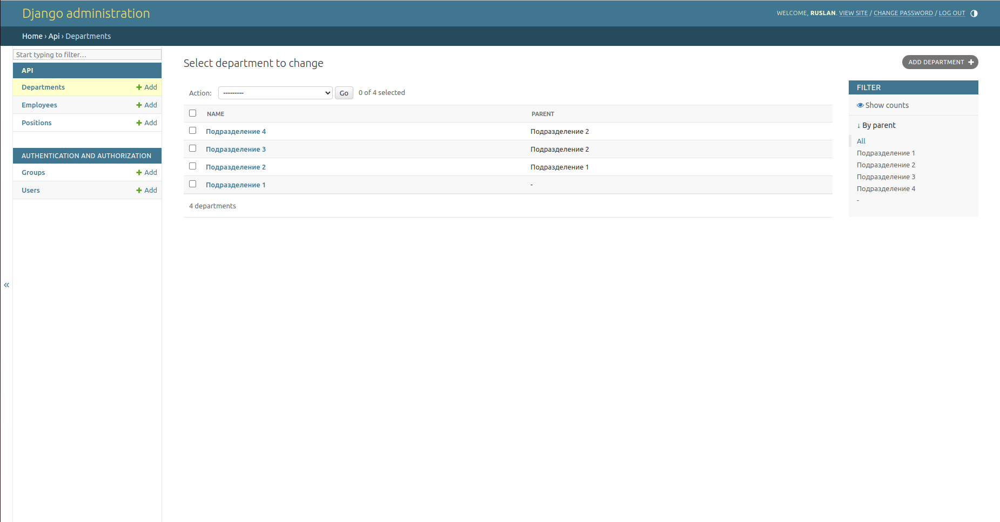
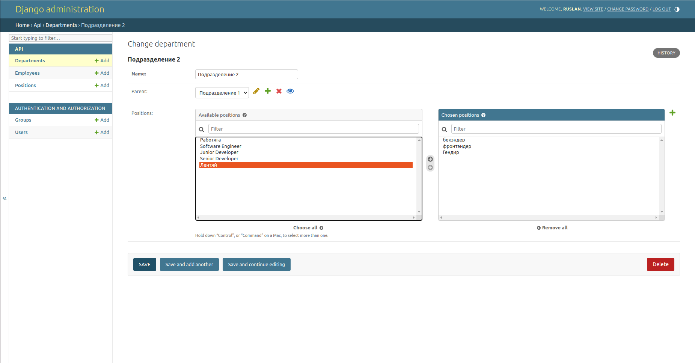
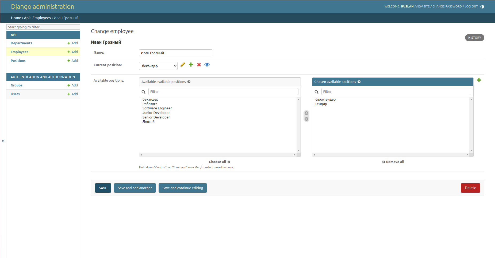
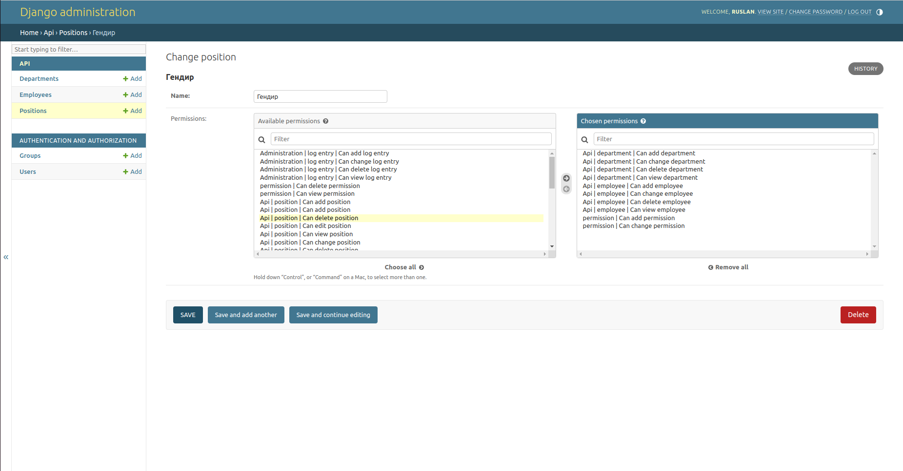
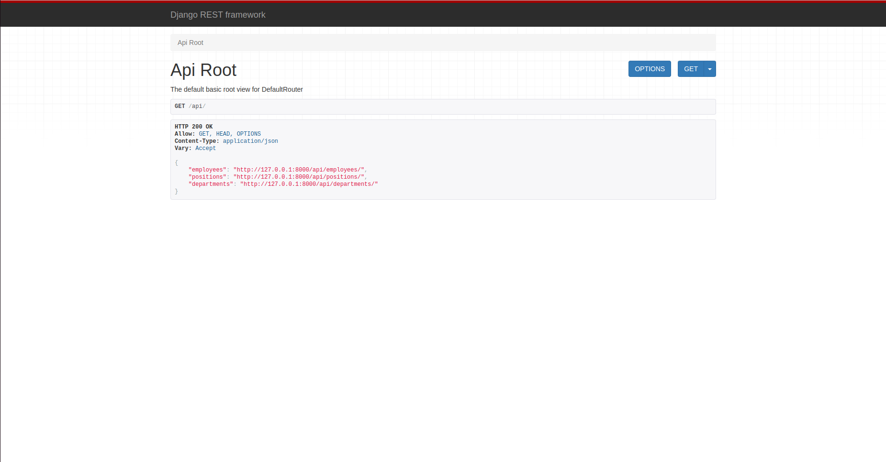
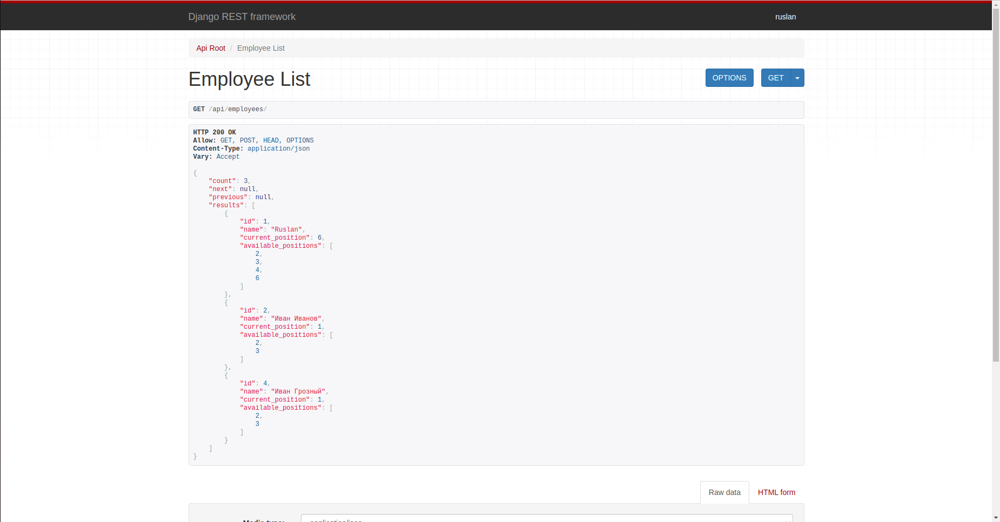
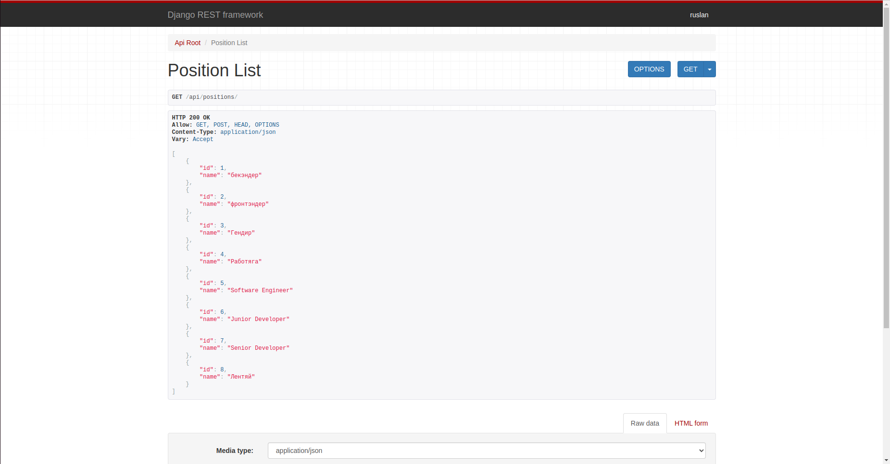
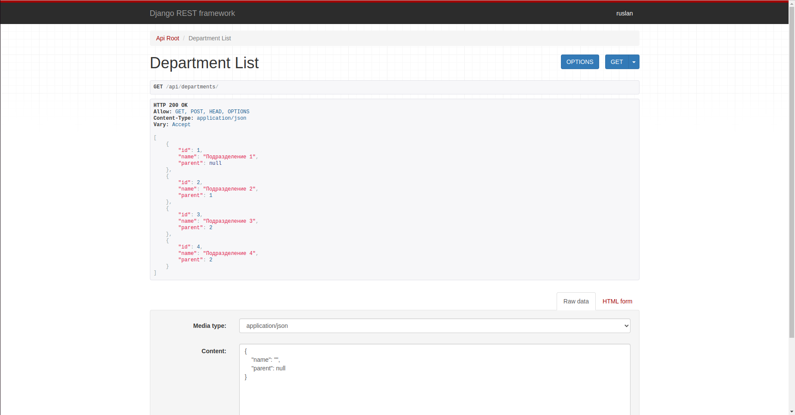

В организации существует множество подразделений.
Подразделение может быть частью другого подразделения.

В каждом подразделении могут быть различные должности.

Каждый сотрудник организации может занимать несколько должностей.

Сотрудники имеют определенный набор прав, в зависимости от их должностей.

на Django создать REST-api для управления структурой компании и правами сотрудников.

